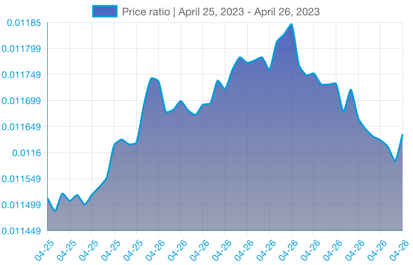

## NTL Function to Produce dynamic charts

I tried creating dynamic charts given various query params like

---

### Endpoints

#### 1. ticker?base=<COIN_ID>

Given a base coin this would plot 30D chart vs USD

#### 2. renderHeatmap

Shows overall market chart as a heatmap

#### 3. renderWatchlist

Shows collections of coins along with their charts as an overview

#### 3. compareTickers?base=<COIN_ID>&target=<COIN_ID>&interval=<PERIOD_IN_DAYS>

Shows collections of coins along with their charts as an overview

---

#### To run locally

1. `ntl run dev` and hit the URL with query params

2. `ntl dev --live` lets you locally replicate prod but needs live-server installed and repo linked to netlify.

Hit `http://localhost:8888/.netlify/functions/<FUNCTION_NAME>` to test them out.

---

The canvas thing on serverless envs is real challenge.
[This](https://github.com/okwme/serverless-canvas/) was a life safer

add the following environment variables to netlify deploy settings (not to the .env file)
`LD_LIBRARY_PATH` to `/var/task/node_modules/canvas/build/Release`

---
